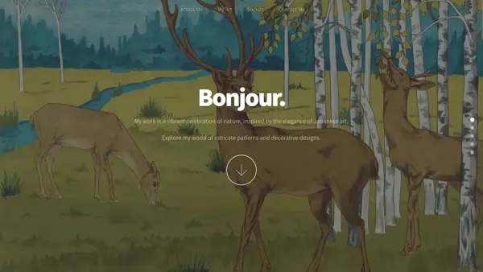

# Chroma Botanica

Chroma Botanica is a fully responsive, single-page art portfolio website that I built for a client. This project includes significant custom features and a streamlined content management approach, allowing my client complete site customization through HTML `data-` attributes.

[Live Demo](https://kitbur.github.io/chroma-botanica/)

## Technologies Used

* **Frontend:** HTML5, CSS3, JavaScript (ES6)
* **Libraries:** jQuery, Poptrox, Scrollex, Breakpoints.js

## Key Features & Custom Implementations

This project was customized to enhance both the user experience and the ease of content management.

### Dynamic Slideshow

A custom JavaScript module (`slideshow.js`) was developed to power the header slideshow.
* **Smart Rotation Logic:** Instead of a simple sequential loop, the slideshow uses a "least viewed" algorithm to ensure a more varied and random-feeling rotation of images. It tracks the view count for each slide and prioritizes displaying the one that has been seen the fewest times.
* **HTML-Driven Configuration:** All slideshow images and their focal points (`background-position`) are configured directly in `index.html` using `slideshowImage` and `slideshowImagePosition` attributes, requiring no changes to CSS or JS files.
* **Interactive Controls:** The slideshow includes responsive navigation dots that pause on hover for improved user control.

### Enhanced Poptrox Gallery

The Poptrox modal gallery was extended to support dynamic social media links within image captions.
* **Data-Driven Icons:** A JSON array can be passed via a `data-caption-icons` attribute on a gallery item's link.
* **Dynamic Icon Rendering:** A custom `caption` function in `main.js` parses this data to dynamically generate and append clickable Font Awesome icons to the caption for each image, linking directly to external profiles or pages.
* **New Responsive Design** The mobile layout was significantly improved at the client's request.

### Centralized Content Management

A primary architectural goal was to empower a non-technical user to manage all site content without editing CSS or JavaScript.
* **`data-` Attributes:** Section background images and their positions are controlled using `data-bg` and `data-bg-position` attributes.
* **Automatic Social Icon Sync:** Social media links added to the "Socials" section are automatically cloned via jQuery to the site's footer, ensuring consistency without duplicate entries.

### Mobile Experience Enhancements

* **Responsive Overlays:** On touch devices, a "Tap for full size" overlay is dynamically added to gallery popups, improving usability where hover interactions are not possible.
* **Optimized Margins:** The Poptrox gallery's window margins are dynamically adjusted based on screen size for a better viewing experience on smaller devices.

## License & Credits

* Copyright &copy; [kitbur](https://github.com/kitbur).
* Built upon "Big Picture" by [@ajlkn](https://github.com/ajlkn) for [HTML5 UP](https://html5up.net), licensed under the [Creative Commons Attribution 3.0](https://creativecommons.org/licenses/by/3.0/).